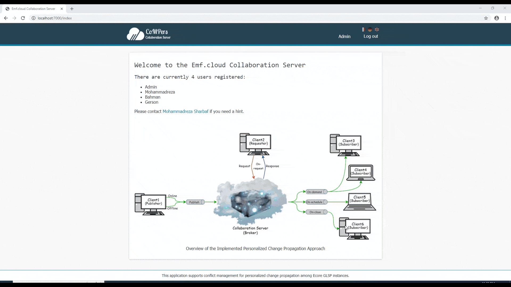
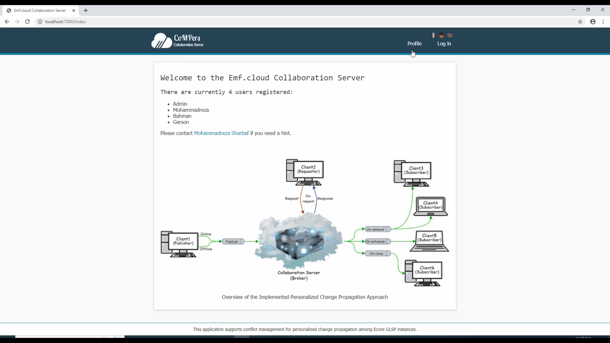

# Collaboration Server

## Prerequisites

### Java
You need Java 11 to build the ecore-glsp editor and Javalin 4.3.0 to communicate with the collaboration server.

## Getting started

Clone the collaboration server:

    git clone https://github.com/MSharbaf/CoMPers.git

## Runnig
  * Execute the Java main class: `CollaborationServer.src.main.java.app` 
  * After that you are able to open the CoMPers dashoboard with your browser at localhost:7000.
    - Use following information to login as Admin: `Username: Admin` and `Password: password`

## Customization Examples

### 1. Set Pattern Matching for Conflict Handling by Admin

### 2. Set Change Overlapping for Conflict Handling by Admin

### 3. Configure A Client by User

### 4. Configure Change Propagation for a Resource by User

