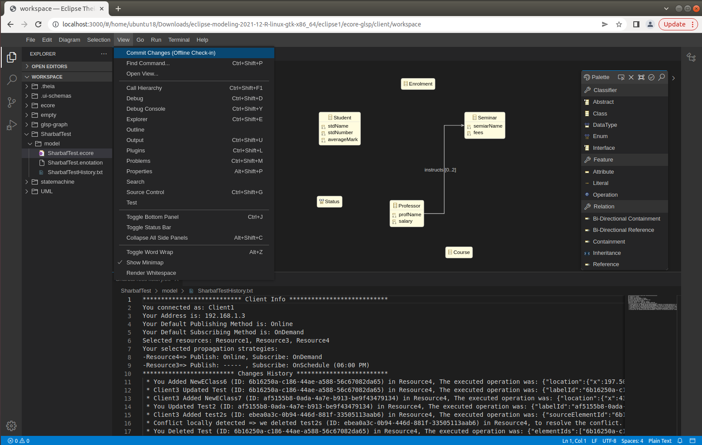
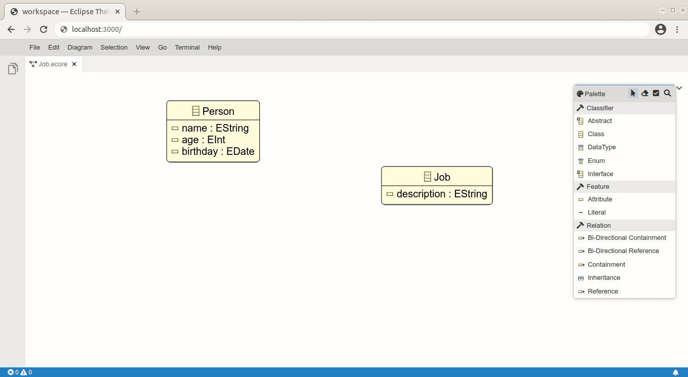

# Extended Ecore-GLSP Editor

## Prerequisites

### Java
You need Java 11 to build the ecore-glsp editor and Javalin 4 to communicate with the collaboration server.

## Getting started

Clone the extended ecore-glsp editor:

    git clone https://github.com/MSharbaf/CoMPers.git

Build server and client with the following build-script. This script also copies the needed server artifacts to the client.

  * cd ecore-glsp
    ./build.sh

Install [Tycho] Target Platform in the ecore-glsp server from Eclipse

Install [nvm] scripts as described in the [client README](https://github.com/eclipse-emfcloud/ecore-glsp/blob/master/client/README.md).

## Runnig
  * Start the ecore-glsp server by running the lunch `org.eclipse.emfcloud.ecore.modelserver-app.Ecore-GLSP App.launch` configuration from Eclipse.
  * Start the ecore-glsp client by running the launch `Start Electron Backend` configuration from VS code.
  * After that you should be able to connect with your browser at localhost:3000.

## Original Ecore-GLSP Editor

Ecore GLSP provides a web-based editor for Ecore Models (including Diagrams), integrated with Eclipse Theia. It contains two components: one [GLSP](https://github.com/eclipse-glsp/glsp) language server (Server-side, written in Java), and one GLSP client extension to actually present the diagrams (Using [Sprotty](https://github.com/eclipse/sprotty-theia)). 

Ecore GLSP can display an existing Ecore model. The diagram layout will be persisted in an .enotation file next to the .ecore file. The diagram editor also supports creation of new elements (EClasses, EAttributes, EReferences...), as well as partial support for editing existing elements (Renaming, deleting...).

For more information, please visit the [EMF.cloud Website](https://www.eclipse.org/emfcloud/).

## Extended Ecore-GLSP Editor

Extended Ecore GLSP provides a web-based editor for collaborative development of Ecore Models using CoMPers collaboration server and based on the Personalized Change Propagation (PCP).

