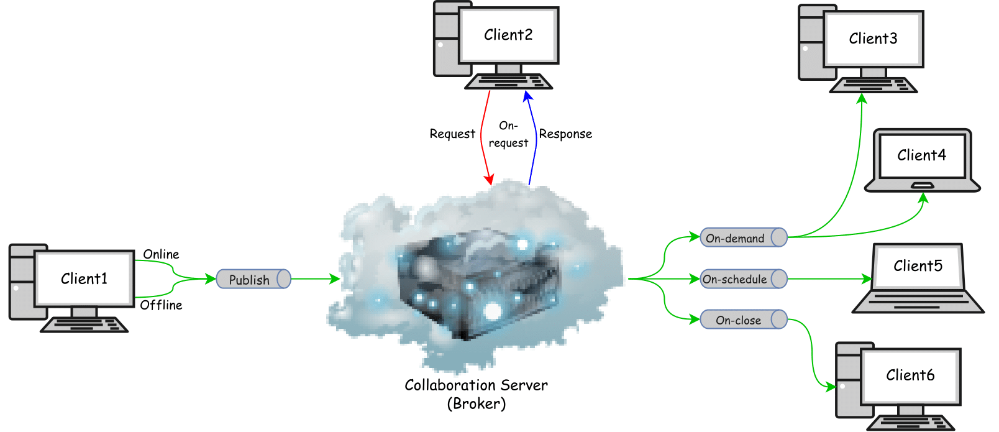

# CoMPers
CoMPers is an extensible framework to provide proper support for configurable conflict management in personalized collaborative modeling. 
The CoMPers framework consists of a centralized [Collaboration Server](https://github.com/MSharbaf/CoMPers/tree/main/CollaborationServer) as well as several Clients that are connected to the Server. 
In our prototype implementation, we extended the Ecore-GLSP editor, which is part of the [EMF.cloud](https://www.eclipse.org/emfcloud/) project, and integrated into the Eclipse Theia IDE to provide a web-based version of the popular Ecore tools. 

## Collaboration Server
The CoMPers collaboration server is central component to support collaborative modeling. It is responsible with processing change operations and conflict management. The collaboration server is located in the `CollaborationServer/` folder and its specific documentation can be found in the [Collaboration Server README](CollaborationServer/README.md).

To start working with the CoMPers collaboration server, please see the video that introduces the [CoMPers Collaboration Server](https://drive.google.com/file/d/1p7L4MO8XiEEdb7RBJw1S1VlI6bjEX2G8/view?usp=sharing).

## Ecore-GLSP Editor
An **example** of how to build the client instance for connecting to the CoMPers collaboration server is the extended version of EMF.cloud Ecore-GLSP Editor located in the `Extended-Ecore-GLSP/` folder and its specific documentation can be found in the [Extended Ecore-GLSP README](Extended-Ecore-GLSP/README.md). 
In the following, we show several examples to represent some possible collaboration scenarios, inconsistency preservation, and conflict handling capabilities in the proposed personalized change propagation approach that is used by the CoMPers framework.   

### 1. Online-OnDemand Collaboration

For more details, please see the [Online-OnDemand Video](https://drive.google.com/file/d/1IwCLoRzR-mZ-GfrgyLRVqZX_cs8V8PZq/view?usp=sharing).

### 2. Offline-OnDemand Collaboration

For more details, please see the [Offline-OnDemand Video](https://drive.google.com/file/d/1Qj2VjCZ8BoEcf9oGrMTcAwOhn_Gvg_B-/view?usp=sharing).

### 3. OnClose Check-out Example

For more details, please see the [Online-OnClose Video](https://drive.google.com/file/d/1mSWfnrGpHEo_jUz4iX91N5FQ-JWXG2NF/view?usp=sharing).

### 4. Inconsistency Preservation Example

For more details, please see the [Inconsistency Preservation Video](https://drive.google.com/file/d/1dui2h7AHNNv6RkV-2-vvvTvon150o0gc/view?usp=sharing).

### 5. Conflict Handling Example

For more details, please see the [Conflict Handling Video](https://drive.google.com/file/d/1cmJT8gBdmq4O77AFPOlXNEkj71C7Cp_p/view?usp=sharing).

