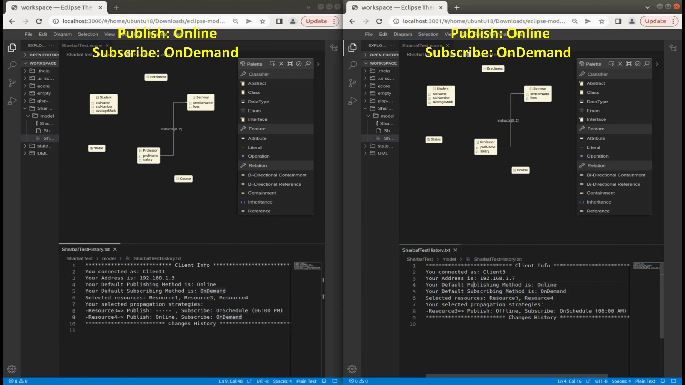

# CoMPers
CoMPers is an extensible framework to provide proper support for configurable conflict management in personalized collaborative modeling. 
The CoMPers framework consists of a centralized [Collaboration Server](https://github.com/MSharbaf/CoMPers/tree/main/CollaborationServer) as well as several Clients that are connected to the Server. 
In our prototype implementation, we extended the Ecore-GLSP editor, which is part of the [EMF.cloud](https://www.eclipse.org/emfcloud/) project, and integrated into the Eclipse Theia IDE to provide a web-based version of the popular Ecore tools. 

## Collaboration Server
The CoMPers collaboration server is central component to support collaborative modeling. It is responsible with processing change operations and conflict management. The collaboration server is located in the `CollaborationServer/` folder and its specific documentation can be found in the [Collaboration Server README](CollaborationServer/README.md).

## Ecore-GLSP Editor
An **example** of how to build the client instance for connecting to the CoMPers collaboration server is the extended version of EMF.cloud Ecore-GLSP Editor located in the `Extended-Ecore-GLSP/` folder. 
In the following, we show some possible collaboration scenarios based on the personalized change propagation approach proposed by the CoMPers framework.   

### Online-OnDemand Collaboration

For more information, please visit the [Online-OnDemand Video](https://drive.google.com/file/d/1xpe0GgBEOx4pUjeULyyKV8UiwlU-V-YK/view?usp=sharing).

### OnClose Check-out Example

For more information, please visit the [Online-OnClose Video](https://drive.google.com/file/d/1mSWfnrGpHEo_jUz4iX91N5FQ-JWXG2NF/view?usp=sharing).

